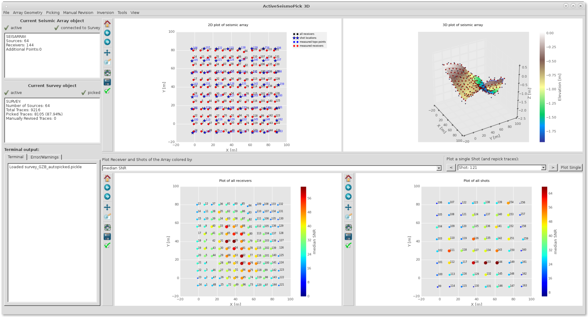

# ASP3D

ActiveSeismoPick3D is a software toolkit for automatic picking of first arrivals and manual revision.
It also offers an easy workflow for refraction tomography, providing an interface to the Fast Marching Tomography algorithm (FMTOMO) and a tool for vtk output.



## Authors and License

ASP3D and some of its components, as well as some examples
are available under terms of the [GNU General Public License](LICENSE) (version 3 or higher)
on [github](https://github.com/seismology-RUB/asp3d).

The main authors are Marcel Paffrath and Wolfgang Friederich (Ruhr-Universitaet Bochum, Germany).


## Examples

ASP3D comes with an exemplary dataset [GZB_data] that can be used to test the program workflow.


## Requirements

* Python 2.7 (not yet completely tested on Python 3)
* obspy (tested on v1.0.3)
* pyside
* FMTOMO code (if you want to use it for tomography)


## Installation

0. If not yet done, you should download the source code of ASP3D by cloning the master branch of the ASP3D repository on github.com:
     ```
     git clone --depth 1 --branch master https://github.com/seismology-RUB/asp3d
     ```

1. Add the path of the asp3d main folder to your python path (optional)


## Example

Start the file ActiveSeismoPick3D_GUI e.g. by typing

      python ActiveSeismoPick3D_GUI

Generate a new Survey object selecting 'File > New Survey'

Now select as receiver file:
'examples/GZB_data/geophone_locations'
As source file:
'examples/GZB_data/shot_locations'
As seismogram directory:
'examples/GZB_data/geode_data'


## Troubleshooting

If the program does not start for any reason, the parameter 'debug-mode' can be added on start to prevent terminal output being redirected to GUI.

      python ActiveSeismoPick3D_GUI --debug-mode


## Notes for using FMTOMO

There are input files for [FMTOMO](http://rses.anu.edu.au/~nick/fmtomo.html) in the directory 'fmcode' that can be used for the example inversion (e.g. smoothing increased). The folder also contains binaries compiled on a debian system. If it does not work for you you should change the binary files in this directory to [FMTOMO](http://rses.anu.edu.au/~nick/fmtomo.html) binaries compiled on your own system!
Note: There is a small bug in the v1.0 of FMTOMO in residuals.f90. You have to move line #47 'tsid=0' to line #51 (just before DO loop).


## Known issues

Depending on your machine/python installation there might be a problem with the GUI freezing when auto-picking has finished.
Try to deselect 'threading' on the picking parameters selection window.

Polygon selection is in need of improvement.
